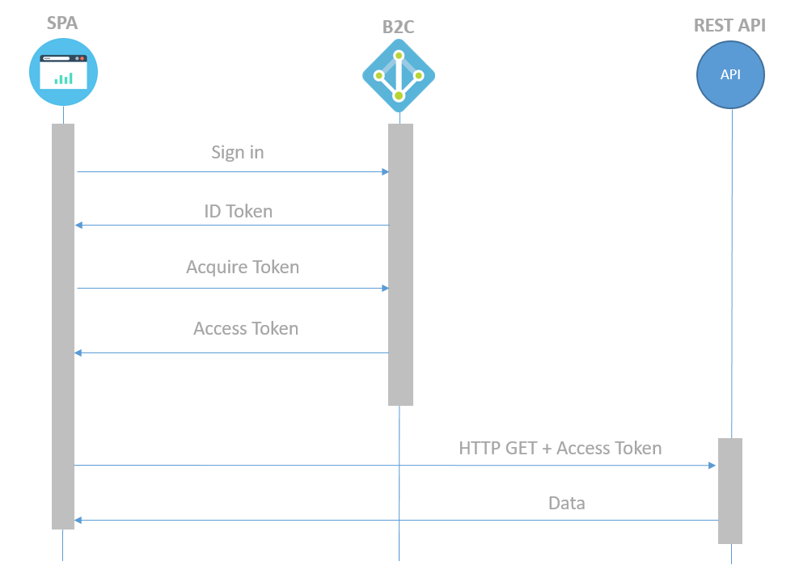

# azure-ad-b2c-login

This is a simple authentication demo that uses Azure Active Directory B2C to authenticate users into a single page application (SPA).

## Authentication Flow

## Single Page Aplication

Angular 9 SPA sample that authenticate users in Azure AD B2C and calls the Spring Boot (Java) and Nodejs APIs.

Access the [documentation](./frontend/angular9/README.md) to know more about this sample.

## API

We have two Web APIs writing in Java and Nodejs, each one of them has a similar endpoint to get the user name from the given token.

> It's only possible to access the APIs passing the token.

You can know more about each APIs accessing the documentation:

- [Spring Boot API](./backend/java-spring-boot/README.md)

- [Nodejs API](./backend/nodejs-express/README.md)
